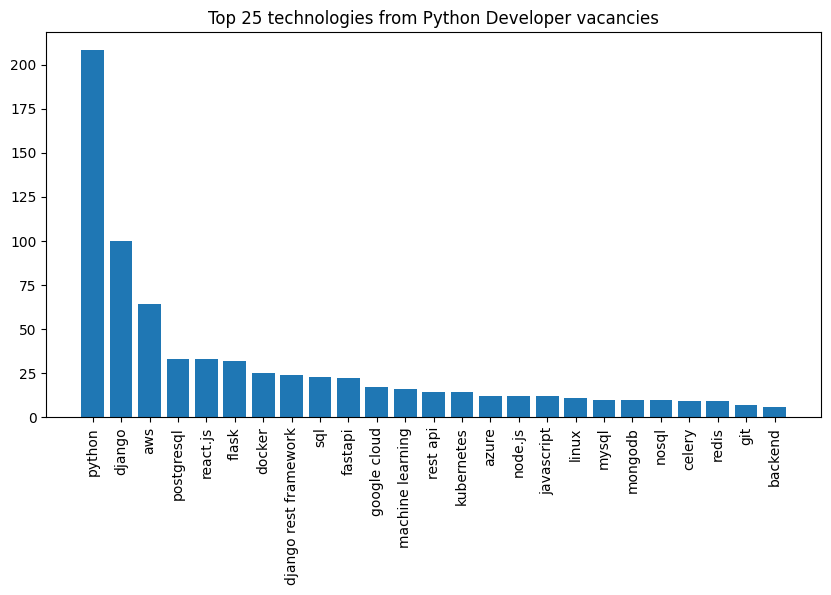

# Python technologies statistics from vacancies

Project consists of two parts:

* Scraping Python Developer vacancies from Djinni website.
* Analyzing scraped data and defining most popular technologies
mentioned in vacancies (as tags).

### Result bar chart



### How to launch project

1. Clone project and create virtual environment

```shell
git clone https://github.com/yuliia-stopkyna/python-tech-statistics.git
cd python-tech-statistics
python -m venv venv
source venv/bin/activate # on MacOS
venv\Scripts\activate # on Windows
pip install -r requirements.txt
```

2. Scrape vacancies to csv

```shell
cd scraping
scrapy crawl vacancies -O vacancies.csv
```

3. Open `data_analysis/vacancies_analysis.ipynb` with Jupyter Notebook and run cells.